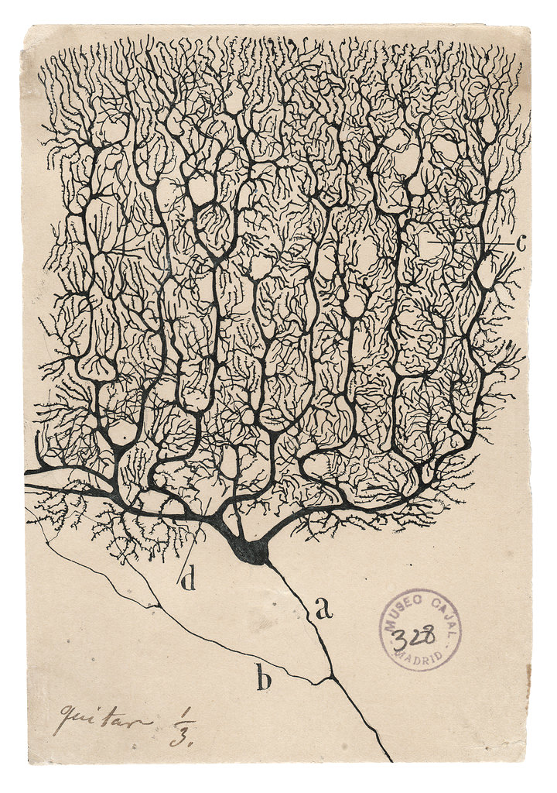
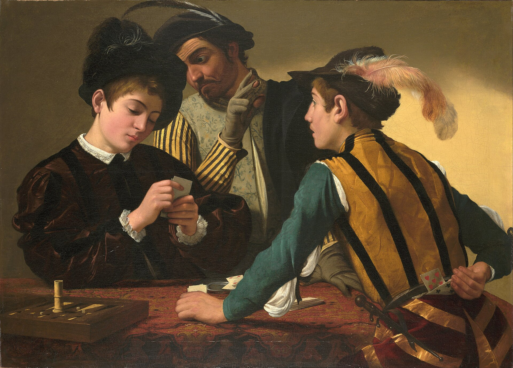

# The Human Mind & the Architecture of Belief — a seven-volume HTML book series

> Premium, illustrated, deeply-researched volumes on psychology, neuroscience, behaviour, consciousness, and the long human history of belief. Each chapter is a single self-contained HTML file (warm-paper book interior, running heads and page-number folios, embedded museum-grade public-domain artwork) — the council voice of practising clinicians and researchers, with a hard separation between established science, debated theory, myth, and pseudoscience marked on every claim.

<p align="center">
  
  <br/>
  <em>From Volume I, Chapter 1 — a single Purkinje neuron of the human cerebellum, drawn in ink by Santiago Ramón y Cajal. From a forest of branches like this one, repeated billions of times, every prediction, memory, and feeling in these books is made.</em>
</p>

> **There's also a landing page.** Open [`index.html`](index.html) for the styled series cover and a full map of the seven volumes; or [`volume-1.html`](volume-1.html) and [`volume-7.html`](volume-7.html) for the volumes currently in progress.

> ⚠️ **Educational, not therapeutic advice.** These volumes describe how perception, memory, attention, decision, belief, and altered states actually work — drawn from published research and clinical literature. They are **not** medical or psychological advice and do not diagnose or treat any condition. Clinical vignettes are illustrative composites in the tradition of Oliver Sacks; they depict no identifiable individual. Where the science is unsettled, debated, or has faced replication challenges, it is labelled as such. If you recognise your own suffering in these pages, please reach out to a qualified mental-health professional — much of what we describe is genuinely treatable, and you need not do it alone.

---

## The seven-volume map

The series moves in expanding rings — from the solitary thinking brain, to the feeling body, to the social crowd, into the wounded and the hidden mind, and finally to the vast structures of faith, evil, and the unexplained. Every chapter is held to a single rule: established science, debated theory, myth, and pseudoscience are colour-tagged on every claim, and the line between them is never blurred.

|  | Volume | Subject | State |
|---|---|---|---|
| **I** | **The Thinking Animal** | Perception · cognition · biases · memory · attention · decision · habit · intelligence · consciousness · free will | **6 of 10 chapters drafted** |
| II | The Feeling Brain | Emotion · fear · attraction · trauma · addiction | Planned |
| III | The Social Animal | Influence · body language · dark psychology · crowds | Planned |
| IV | The Wounded Mind | Mental illness · the history of psychiatry · treatment | Planned |
| V | The Hidden Mind | Freud · Jung · the unconscious · dreams · archetype | Planned |
| VI | The Believing Mind | Why we believe · ritual · morality · death · cult · myth | Planned |
| **VII** | **Gods, Demons & the Edge of Reason** | Spirits · mediums · witches · astrology · pseudoscience · god · conspiracy · the honest investigation | **2 of 10 chapters drafted** |

---

## Volume I — *The Thinking Animal*

The flagship effort: a progressive treatment of how the mind builds a world, makes its typical mistakes, remembers, attends, decides, and chooses. Each chapter stands on the one before it; read in order.

|  | Chapter | Words | View HTML |
|---|---|---:|---|
|  | **1 — The World You Cannot Reach** *(perception · controlled hallucination · therapy as updating the guess)* | ~5,500 | [Open](chapters/v1-ch01-predicting-brain.html) |
|  | **2 — Two Minds in One Head** *(System 1 / System 2 · biases · loss aversion · framing · the gut-trust grapple)* | ~5,700 | [Open](chapters/v1-ch02-two-minds.html) |
|  | **3 — The Catalogue of Beautiful Mistakes** *(confirmation · availability · hindsight · sunk cost · conformity · ecological rationality)* | ~5,400 | [Open](chapters/v1-ch03-catalogue.html) |
|  | **4 — The Story We Rewrite Each Night** *(Ebbinghaus · H.M. · Loftus · reconsolidation · the trauma payoff)* | ~4,300 | [Open](chapters/v1-ch04-memory.html) |
|  | **5 — The Spotlight and the Dark** *(the invisible gorilla · William James · the attention economy · deep work · ADHD)* | ~4,900 | [Open](chapters/v1-ch05-attention.html) |
|  | **6 — How We Decide** *(Damasio · Bernoulli · hyperbolic discounting · somatic markers · regret · trolleys)* | ~4,700 | [Open](chapters/v1-ch06-how-we-decide.html) |
| — | 7 — The Automatic Self *(habit, repetition, the second nature)* | — | *Planned* |
| — | 8 — Cleverness and Its Myths *(intelligence, IQ, creativity)* | — | *Planned* |
| — | 9 — The Hard Problem *(why there is something it is like to be you)* | — | *Planned* |
| — | 10 — Who Is Driving? *(free will and the illusion of the author)* | — | *Planned* |

---

## Volume VII — *Gods, Demons & the Edge of Reason*

Where the mind meets darkness and the unexplained — spirits, ghosts, mediums, witches, astrology, energy healing, god, and the conspiratorial mind — held to the same honest light. Two chapters drafted, with a full ten-chapter contents page at [`volume-7.html`](volume-7.html).

|  | Chapter | Words | View HTML |
|---|---|---:|---|
|  | **2 — The Possessed** *(demons, exorcism, the Salpêtrière reinterpretation; Anneliese Michel; possession as idiom of distress)* | ~3,000 | [Open](chapters/possession-and-evil.html) |
|  | **3 — The Ghost in the Plate** *(spirit photography, Fox sisters, Mumler, D. D. Home, Eusapia Palladino, Houdini; pareidolia, sleep paralysis, ideomotor, cold reading; the honest remainder)* | ~5,400 | [Open](chapters/v7-ch03-ghost-in-the-plate.html) |
| — | 1 — Why We See What Isn't There *(the hyperactive agency detector — the universal foundation under every other belief in this volume)* | — | *Planned* |
| — | 4 — The Mediums *(deeper — cold reading, trance, modern television heirs)* | — | *Planned* |
| — | 5 — Witches and the Black Art *(Malleus to Salem to modern child-witch accusations)* | — | *Planned* |
| — | 6 — The Stars and the Hand *(astrology, palmistry, the Forer/Barnum effect)* | — | *Planned* |
| — | 7 — The Pseudoscience Museum *(phrenology to energy healing; placebo and nocebo)* | — | *Planned* |
| — | 8 — God and the Mystic Brain *(neurotheology, temporal-lobe mysticism, near-death, psychedelics, the limits of science)* | — | *Planned* |
| — | 9 — The Conspiratorial Mind *(modern paranormal belief, hidden-agent thinking)* | — | *Planned* |
| — | 10 — The Honest Investigation *(what science can and cannot answer)* | — | *Planned* |

---

## How to read (two options)

### 1 · Read in your browser (the best experience)

Click any **Open** link in the tables above while signed in to GitHub. GitHub shows HTML as source by default; to actually render a chapter, see *"Browser preview"* below — or download the file and open it locally (each chapter loads its shared stylesheet from `assets/book.css` and its real artwork from `assets/img/`, so you'll want the whole repo cloned, not a single file).

### 2 · On mobile

The chapters reflow for phone screens — the running head, the folio footer, the asides, and the page sheet all collapse cleanly. Clone the repo to a phone-readable storage and open the chapter file in your phone's browser, or use a desktop browser to read in comfort.

---

## Browser preview (rendering HTML, not source)

GitHub natively shows HTML as **source code**, not rendered. To preview the chapters in a real browser, your options depend on visibility:

### If this repo is **private** (current state)

Third-party preview services (`htmlpreview.github.io`, `raw.githack.com`) **do not work** for private repos — they can't see your files. The practical options while private:

- **Clone the repo and open `chapters/*.html` locally.** The shared CSS and embedded artwork all resolve via relative paths; nothing is fetched at runtime except Google Fonts.
- **Use the GitHub web UI**: open the file, click **Raw**, then **Save Page As…** to download — but you'll need `assets/book.css` and the chapter's images alongside it for the design to render.

### If you want a permanent public URL while keeping the repo private

The cleanest free path is **Cloudflare Pages**: connect the GitHub app, pick this repo, leave the build command blank and the publish directory as the repo root, and click *Save and Deploy*. You'll get a permanent URL like `https://mind-and-belief.pages.dev/` that auto-redeploys on every push. Netlify works the same way (`https://mind-and-belief.netlify.app/`). Both support private repos and are free.

### If you make this repo **public**

Each chapter becomes one-click previewable via:

- **htmlpreview.github.io** (free, public repos only)
  `https://htmlpreview.github.io/?https://github.com/chethanbhatbs/mind-and-belief/blob/main/chapters/v1-ch01-predicting-brain.html`
- **raw.githack.com** (similar)
  `https://raw.githack.com/chethanbhatbs/mind-and-belief/main/chapters/v1-ch01-predicting-brain.html`

---

## Design

A printed-book interior, not a webpage. White paper-sheet on a dark reading desk; **Cormorant Garamond** for display, **EB Garamond** for body, justified text with first-line indents and drop caps; a fixed **running head** at the top of every chapter (book title left, chapter title right) and a fixed **page-number folio** at the bottom (volume left, live `p. X / Y` right, computed from scroll position). A single ochre-gold accent (`#8A6A2F`) and a deep oxblood (`#7A2E26`); no drop-shadows, no rounded corners, no gradients. Evidence is **never** presented as a colored-edge web card — it lives in *scholarly asides* (a small-caps coloured label between thin rules) and in *editorial feature boxes* (a clean keyline frame with a centered small-caps header). Two recurring devices structure each chapter: **The Round Table**, in which six named voices — the Neuroscientist, the Clinician, the Analyst, the Philosopher, the Skeptic, the Existentialist — speak in turn to a single question; and **From the Consulting Room**, a Sacks-style clinical vignette set in a thin oxblood frame.

Every chapter follows the same scaffold: a real public-domain frontispiece (Goya, Bruegel, Caravaggio, Vermeer, Cajal, Rossetti, Charcot, Mumler), a Merleau-Ponty- or Hamlet- or Pascal-tier epigraph, a personal hook that plants a through-line question, a long body that earns the answer, a grapple with the strongest objection, a section on lived everyday relevance, a Round Table, *Myth vs Reality*, a *Limits & Self-Criticism* tier, and a closing **Essence** double-ruled panel of keeper lines with one *"if you keep one sentence"* at the bottom. References, recommended reading, and chapter-nav follow.

The illustrations are **real public-domain art from museum collections**, sourced via Wikimedia Commons and verified by eye before inclusion: Cajal's neurons (Museo Cajal), Bruegel's *Blind Leading the Blind* (Capodimonte), Caravaggio's *Calling of St Matthew* (San Luigi dei Francesi), Vermeer's *Astronomer* (Louvre), Rossetti's *Mnemosyne* (Delaware Art Museum), Brouillet's *Clinical Lesson at the Salpêtrière*, Goya's *Witches' Sabbath* (Lázaro Galdiano), Mumler's *Mary Todd Lincoln* spirit photograph, Pot's *Wagon of Fools* (Frans Hals Museum). No AI-generated illustration, no hand-drawn vector "diagrams" pretending to depict real objects — that rule is written into [`memory`](https://github.com/chethanbhatbs) and learned the hard way.

---

## What's in each finished chapter

**Volume I, Chapter 1 — The World You Cannot Reach** *(perception)*
Opens with the case of Virgil, the man given sight in middle age by Oliver Sacks who could not *see* — because seeing is the brain's achievement, not the eye's. Helmholtz's "unconscious inference," Anil Seth's *controlled hallucination*, the blind-spot try-it-yourself, the prediction-error loop, and an extensive treatment of how the same mechanism becomes anxiety, depression, trauma, prejudice, and the placebo — closing with how therapy works as feeding the brain corrective evidence until a frozen prior finally updates.

**Volume I, Chapter 2 — Two Minds in One Head** *(cognition)*
The fast mind that saved the firefighter's life is the same fast mind that wrecks your judgement in a quiet room. The Kahneman–Tversky friendship; the bat-and-ball trap; the law of least effort; the Linda problem; Mischel's pupil-dilation studies; loss aversion and prospect theory with the value-curve worked numerically; the Asian disease framing experiment; the Kahneman–Klein reconciliation on *when* a gut feeling can be trusted; and three practical tools that actually work — danger-signs, tripwires-in-the-world, *what else could be true?* — with the catastrophising consulting-room vignette as the bridge to cognitive therapy.

**Volume I, Chapter 3 — The Catalogue of Beautiful Mistakes** *(biases)*
Opens at the Dutch tulip mania of 1637, with Pot's *Wagon of Fools* as the frontispiece. Five biases at depth — confirmation (Festinger's *When Prophecy Fails*, the Wason selection task), availability (Tversky–Kahneman, the bedroom-vs-terrorism comparison), hindsight and narrative (Fischhoff, Taleb), endowment / sunk cost / status quo (Knetsch's mugs, opt-in vs opt-out organ donation), and conformity (Asch); Galton's ox-weighing as the founding wisdom-of-crowds; Gigerenzer's *ecological rationality* as the grapple. Closes with the pre-mortem, *consider the opposite*, and the *outside view* as the only interventions that actually move people.

**Volume I, Chapter 4 — The Story We Rewrite Each Night** *(memory)*
Opens with the George Franklin case — a man imprisoned on his daughter's recovered "memory" of a murder, later overturned — and runs through Ebbinghaus's forgetting curve, Bartlett's schemas, Henry Molaison and the discovery of the hippocampus, reconsolidation, Loftus's lost-in-the-mall study and the wrongful-conviction record, post-bereavement hallucination as a non-pathological phenomenon, and the trauma payoff: the very plasticity that allows false memory in the laboratory is what allows a trauma, in careful clinical hands, to be loosened in the consulting room.

**Volume I, Chapter 5 — The Spotlight and the Dark** *(attention)*
The invisible gorilla. William James in 1890. The two modes — bottom-up (the world calling) and top-down (the deliberate hand) — diagrammed by Vermeer's *Astronomer*, Bruegel's *Children's Games*, and Caravaggio's *Calling of St Matthew* in turn. Inattentional blindness, change blindness, the radiologist who missed the gorilla in the lung scan, the attention economy (variable rewards, notifications, infinite scroll, Tristan Harris), the multitasking myth as task-switching cost, and ADHD as the broken top-down hand. Closes with practical protected windows and removed captures as a Ulysses-contract toolkit.

**Volume I, Chapter 6 — How We Decide** *(decision, risk, regret)*
Damasio's patient Elliot — perfectly intelligent, completely unable to choose — opens the central thesis: reason without feeling cannot rank; emotion is the engine of judgement, not its contaminant. Bernoulli's expected utility, hyperbolic discounting and Mischel's marshmallow study held to current replication evidence, the Iowa Gambling Task and the somatic-marker hypothesis (with Cézanne's *Card Players* as the imagery), Loomes & Sugden's regret theory, the Foot/Thomson trolley problems and Greene's fMRI work. Closes with three real disciplines: tying yourself to the mast, running the reversal on every "keep or sell," and imagining both rooms at eighty.

**Volume VII, Chapter 2 — The Possessed** *(demons, exorcism, evil)*
Anneliese Michel as the opening. The history (Mesopotamian *gidim* → the Malleus → the *Rituale Romanum* → the Salpêtrière's reclassification of "demoniacs" as hysterics, with Brouillet's *Clinical Lesson* and a witch-burning woodcut as the imagery). The clinical differential: dissociative identity & possession-form disorder, temporal-lobe epilepsy, autoimmune encephalitis. Possession as an *idiom of distress* among the powerless. The Loudun convent. Mass psychogenic illness. The cultural side — Vodou, Zār, Candomblé — as the same capacity rendered as blessing, not affliction.

**Volume VII, Chapter 3 — The Ghost in the Plate** *(spirits, mediums, photographs)*
The Fox sisters at Hydesville in 1848 and their 1888 confession; the rise of Spiritualism in a century of mass grief; Mumler's spirit photographs with the iconic Mary Todd Lincoln plate as frontispiece; the 1869 fraud trial; D. D. Home as the still-unsolved residue and Eusapia Palladino as the caught-but-puzzling case; Houdini's long war on the séance and the cost in his friendship with Conan Doyle. Then the psychology that explains almost all of it — pareidolia, sleep paralysis, the ideomotor effect, cold reading, the Forer effect — paired with explicit sections on **what science cannot answer**, including post-bereavement hallucinations as a normal, non-pathological human experience.

---

## How the artwork was sourced

Every illustration is a real public-domain work, downloaded directly from Wikimedia Commons via `Special:FilePath/<File>.jpg?width=N` with a courtesy `User-Agent` header, then **verified by eye** before being added to the chapter. The discipline is written into the project's working notes: no hand-drawn vector "illustrations" of real objects (brains, organs, faces, scenes); for those, a real museum image is sourced. Conceptual / process diagrams (the predict-compare-error-update loop, the System 1 / System 2 comparison) are kept clean and ink-on-paper, or folded into prose where a diagram would have been amateur. Photographic plates that need a dark backdrop (the MRI, the spirit photograph) use the `.plate--dark` style; line diagrams sit in the lighter `.plate` panel.

The sourcing pattern, for the technically curious:

```bash
UA="MindBeliefBook/1.0 (educational; contact)"
curl -sL -A "$UA" \
  "https://commons.wikimedia.org/wiki/Special:FilePath/Cajal%20-%20a%20purkinje%20neuron%20from%20the%20human%20cerebellum.jpg?width=900" \
  -o assets/img/ch1/cajal-purkinje.jpg
# … then `file -b --mime-type` to confirm it's an image, and Read it to verify the right subject.
```

---

## Notes

- **Single-source, multi-page**: unlike some other book series, each chapter here is one HTML file that links the shared `assets/book.css` and the chapter's specific real artwork in `assets/img/<vol>/<topic>/`. Clone the whole repo; do not download single files in isolation.
- **Voice**: written in the council voice — the assembled standpoint of clinicians, neuroscientists, analysts, philosophers, skeptics, and existentialists. The first-person-plural is deliberate and reflects the literary device, not a single author.
- **Evidence tiering** is enforced on every claim — 🟢 science, 🟡 debated/emerging, 🟣 myth/religion/philosophy, 🟤 pseudoscience — so the line between *what we know*, *what we partly know*, and *what we don't know* is never blurred.
- **Citations** are illustrative of the evidence base; a production edition would carry full bibliographic apparatus and externally verified DOIs.
- **Clinical vignettes are composites** in the tradition of Oliver Sacks. They depict no identifiable individual; they describe principles routinely observed in published case literature.
